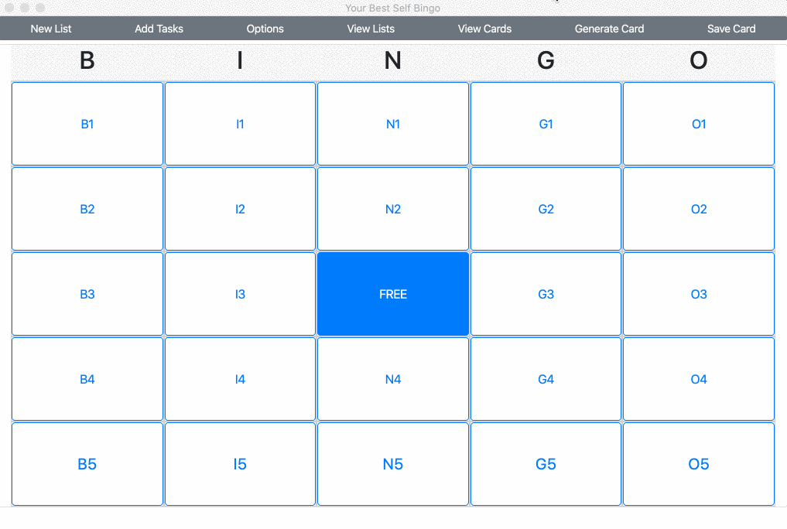

# Your Best Self Bingo
<p align="center">


</p>
<p align="center">

</p>
<p align="center" style="font-family:cursive;font-size:18px;border-bottom:2px dotted;">
 <i>BINGO to help you achieve your goals.</i>
</p>

## Contents

 - [Installation and Startup](#Installation-and-Startup)
 - [How to Play](#HowtoPlay)
   - [Getting Started](#Getting-Started)
   - [Lists and Tasks](#Lists-and-Tasks)
   - [Active Lists](#Active-Lists)
   - [Cards](#Cards)
     - [Saving Your Card](#Saving-Your-Card)
     - [Retrieving Your Card](#Retrieving-Your-Card)
   - [Getting a Bingo](#Getting-a-Bingo)
   - [Blackouts](#Blackouts)
  - [FAQ](#FAQ)
    - [How do I delete a list?](#How-do-I-delete-a-list)
    - [How do I delete a card?](#How-do-I-delete-a-card)
    - [How do I report a bug or issue?](#How-do-I-report-a-bug-or-issue)
    - [Do you welcome pull requests?](#Do-you-welcome-pull-requests)
    - [Some of your dependencies are outdated or deprecated.](#Some-of-your-dependencies-are-outdated-or-deprecated)
    - [Is there an online mode?](#Is-there-an-online-mode)
    - [Is there a mobile app?](#Is-there-a-mobile-app)
  - [Credits](#Credits)
  - [Changelog](#Changelog)
  
## Installation and Startup

Currently only [npm](https://www.npmjs.com/) is supported. Node.js is required. To see if you have Node and npm installed, type the following lines in your terminal:

  ```
  node -v
  npm -v
  ```

This will tell you the versions of Node.js and npm your system is currently running, if they are installed. If not already installed, you can download the appropriate [Node.js installer](https://nodejs.org/en/download/) for your operating system. Make sure to download from the LTS tab, as these versions have been tested with npm. 

If you install Node this way, npm will come prepackaged with it, so no separate installation is necessary. 

You can download the [latest production-ready release](https://github.com/meganrenae21/life-bingo/releases/tag/v0.1.0) (recommended) or the [latest pre-production version](https://github.com/meganrenae21/life-bingo/releases/tag/v0.1.1) and unzip the files to your desired location. 

If you'd prefer, you can also use git clone to install on your system:

```
### to install the latest stable version
git clone --branch dist https://github.com/meganrenae21/life-bingo.git

### to install the latest prerelease
git clone --branch develop https://github.com/meganrenae21/life-bingo.git
```

Note that if you download a prerelease, the documentation (this readme file) may not be up to date. Be sure to switch this repository branch to `develop` for the most current documentation.

In the terminal, navigate to the path that has the `package.json` file and start the app with:

  ```
  npm start
  ```

If you are unfamiliar with how to navigate the file system via the terminal, you can refer to this quick little crash course from [Codecademy](https://www.codecademy.com/learn/learn-the-command-line/modules/learn-the-command-line-navigation). 

## How to Play

YBS Bingo has three core data types: _tasks_, _lists_, and _cards_.

Each space on the bingo card is filled with a _task_, and _tasks_ are entered in _lists_. _Cards_ are generated from selected _lists_. 

For example, if **Carol**, **Kathy**, and **Layla** wanted to make cards using separate to do lists, you could create a list for each of them, adding their to dos in their specific lists. That may end up looking like this:

**Carol**
  - Walk the dog
  - Buy groceries

**Kathy**
  - Feed cats
  - Finish report for boss

**Layla**
  - Do math homework
  - Make bed

Once a list has at least 24 tasks, you can generate a bingo card using tasks in that list. In this case, you could create separate cards for Layla, Carol, and Kathy. You can also *combine* lists to create a card (for instance, if you wanted to create separate lists for work-related tasks and personal tasks but wanted both types of tasks on one card), as long as there are 24 tasks _total_ on all the lists you are generating the card from. 

The following sections will go into more detail about how to create and modify cards, tasks, and lists.

### Getting Started

When you open the app, you will see a 5x5 grid, with each grid space labeled by its position (B1, B2, etc.). The Free space at the center of the grid is in a selected position. The other spaces are not selected, and while you can hover over them, you'll notice that if you click on them, nothing happens. Before you can do anything, you need to set up your card, which is done using the top menu.

### Lists and Tasks

Before you can add tasks to be added to the card, you need to create a list to add tasks to. You will be unable to add any tasks if you don't have a list to associate them with.

Click the "New List" button to create a new list. Give the list a descriptive title. You also have the option to add tags to your list, for further organization. This is not required.


Once you've created a list, click save. You can create as many lists as you want. When you are ready to start adding tasks, exit the New List module and click "Add Tasks" on the top menu.


This is pretty intuitive -- just select the list you'd like to add a task to, write down the task, click save, then repeat as often as you need. Remember, you'll need at least 24 tasks total to generate a card -- they don't all have to be from the same list. 

If click on "View Lists", a modal will open up showing all of your lists. Click on one to view all of the tasks within that list. You can also delete tasks from here.


### Active Lists

After you've entered your tasks, there's one more step to take before you can generate a card -- setting your active lists.

This is in the "Options" menu. You'll see a checklist of all of your lists. Check each list whose tasks you want to generate your card from. As mentioned, you'll need at least 24 tasks total between all of your active lists to create a card. Also note that if you have _more_ than 24 tasks, not all of your tasks will appear on your card.


### Cards

Once you've entered enough tasks and selected your active lists, generating your bingo card is as simple as clicking "Generate Card". Click on tasks to mark them as complete. If you accidentally click on a box, click again to unmark it.


Note: The free space at the center of the card cannot be unchecked.
  
#### Saving Your Card

You cannot retrieve your card in a future session without saving it first. Click "Save Card", which opens a modal allowing you to name your card and, if you want, add tags. When you click, this will store the card in the app's database, which is hosted locally on your machine.


Saving your card as a copy will create a new card, rather than overriding changes to the current card. When you do this, the active card will be the newly made copy, meaning if you save again, the changes will be saved on the newer card. You'll need to [retrieve the original card](#retrieving-your-card) to save changes on it.


#### Retrieving Your Card

To retrieve a card you've previously saved, click "View Cards" from the menu. This will give you a table with a list of all of your saved cards, along with their tags. Each card will let you know how many bingos you have on that card and whether or not you have a blackout (have completed every task on the card). You can also delete cards from this screen. Deleting a card will remove it from the app's data center, so be careful -- deleted cards cannot be retrieved.



### Getting a Bingo

There are twelve possible "bingos" on each card -- one for each column, one for each row, and one for each diagonal. The total number of bingos you have is calculated upon save and then stored in the database.


### Blackouts

A blackout occurs when you've completed every task on your card. The card remains saved in the database, and you can view all the card you've gotten a blackout on via the "View Cards" button. 


## FAQ

### How do I report a bug or issue?

Please use the [issues tab](https://github.com/meganrenae21/life-bingo/issues) for bug reporting. Make sure to look through current open issues to ensure you are not submitting a duplicate. Please properly label your issue with one of the following (**please do not give the issue a priority label**):

- **bug**: something is broken that won't allow you to access the app's core functionality
- **enhancement**: you have a suggestion for an added feature or functionality
- **question**: you need info on how to do something in the app, or a general question about how the app works
- **documentation**: you found something amiss in the doc file, such as a broken link or directions that are no longer valid
- **dependency**: an issue related to one of the app's dependency (ex: a dependency is deprecated, or the app is out of date with a dependency)

### Do you welcome pull requests?

Since this app is currently so early in development and I'm still working out its core features, at the time the answer is no. Once I get the wheels spinning, I'd be more than happy to welcome PRs to add features and improve function. If you have a request for an enhancement at the moment, you can always submit an [issue](https://github.com/meganrenae21/life-bingo/issues) with the *enhancement* label.

That said, this project is open source, so feel free to clone and fork it and make it your own.

### Some of your dependencies are outdated or deprecated.

Yes, I am aware of this issue, and I am actively attempting to bring this up to date. If you happen to notice a dependency that is currently deprecated or no longer being maintained, please see the [issues tab](https://github.com/meganrenae21/life-bingo/issues) to see if there's already an issue open for it. If there isn't, please open an issue so that I can be aware.

### Is there an online mode?

At the moment, no. I do want to make an online version of the app happen, though. You can see where I'm at by taking a look at the [Online Mode](https://github.com/meganrenae21/life-bingo/projects/1) project in the Projects tab. However, I can't promise that this will be done any time soon.

### Is there a mobile app?

No. Right now I have no plans to bring this app to mobile. 

## Credits

  - [Electron](https://www.electronjs.org/)
  - [Electron About Window](https://github.com/rhysd/electron-about-window)
  - [nedb](https://github.com/louischatriot/nedb)
  - [Sweet Alert](https://github.com/t4t5/sweetalert)
  - [uuid-random](https://github.com/jchook/uuid-random)
  - [Bootstrap 4](https://getbootstrap.com/)
  - [jQuery](https://jquery.com/)
  - [shortid](https://github.com/dylang/shortid)

## Changelog

### 0.1.0 - 2021.08.15

[Initial public release](https://github.com/meganrenae21/life-bingo/releases/tag/v0.1.0)